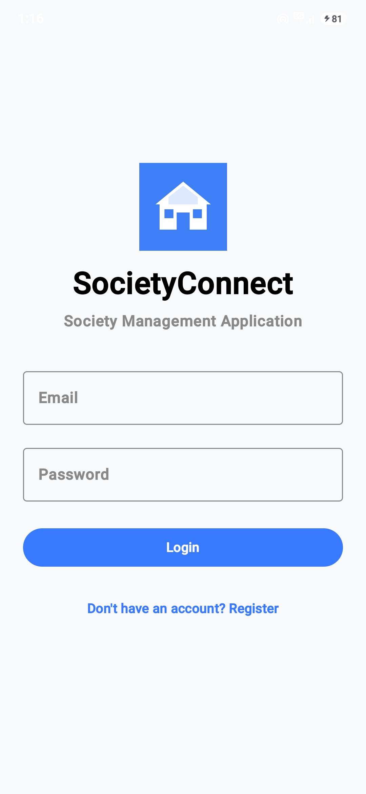
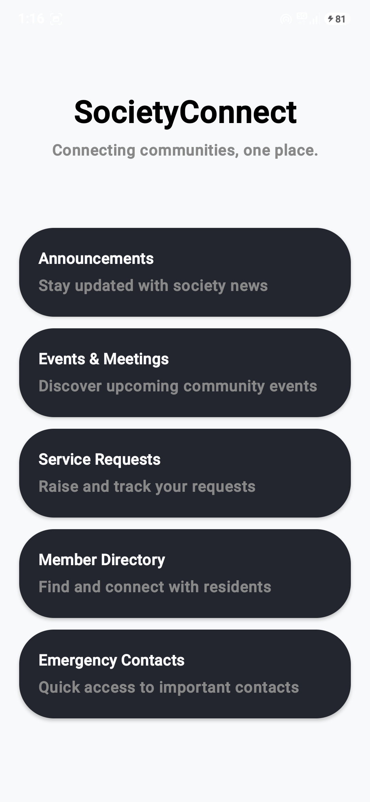
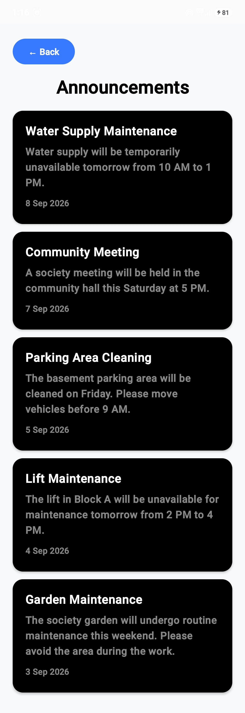
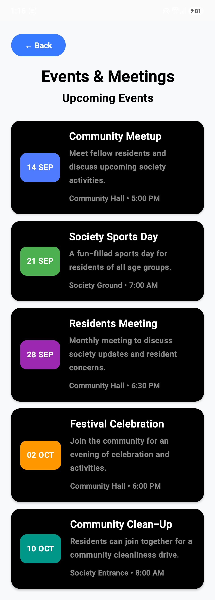
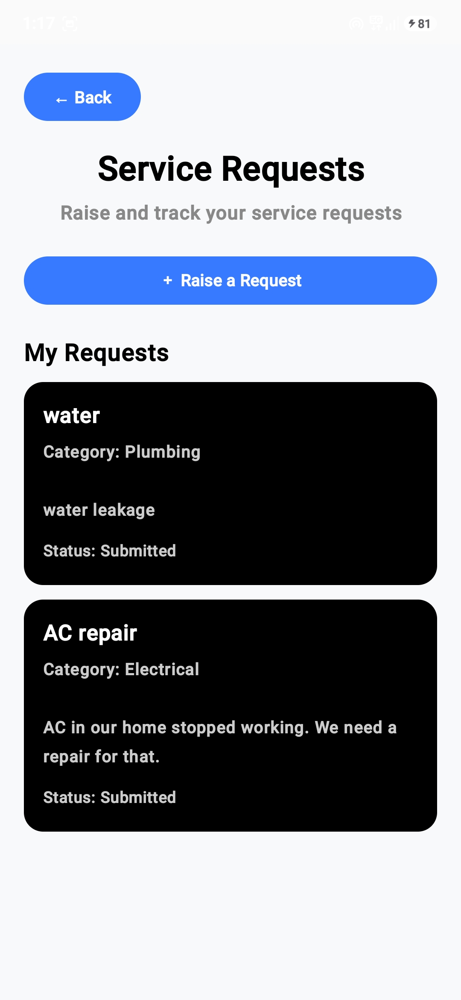
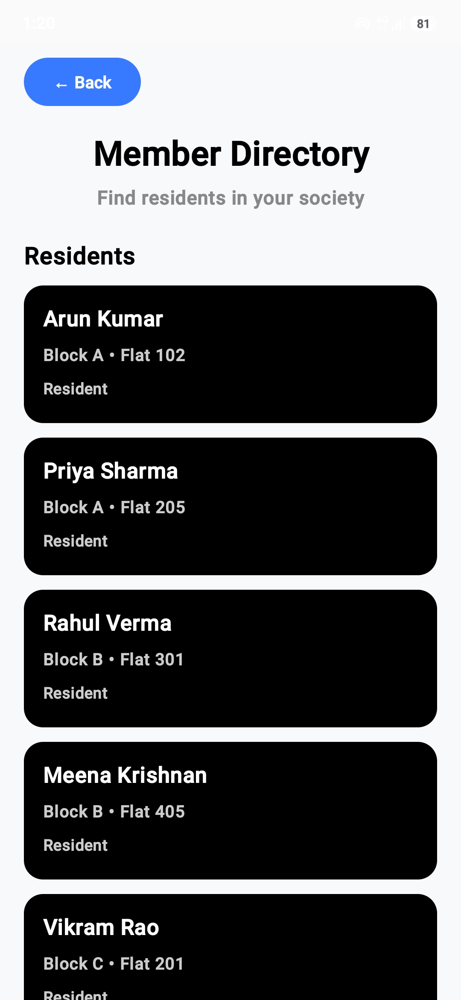
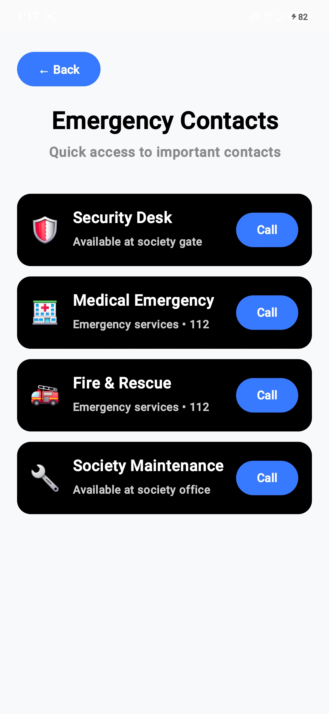

# SocietyConnect

SocietyConnect is an Android-based residential society management application designed to help residents access important society information and manage common community activities from one place.

## Project Overview

SocietyConnect provides a simple and user-friendly interface for residents to:

- View society announcements
- View upcoming events and meetings
- Raise and track service requests
- Browse the society member directory
- Quickly access emergency contacts
- Register and log in to the application

The application is designed with a focus on clean UI, maintainable code, reusable components, and a simple architecture that can be extended in the future.

## Implemented Features

### 1. Authentication

- Resident registration
- Login with registered credentials
- Local persistence of authentication data
- Basic login validation and error handling

### 2. Announcements

- Digital notice board
- Society announcements with date and description
- Scrollable announcement list

### 3. Events & Meetings

- Upcoming community events
- Event date, location, and time
- Scrollable event list

### 4. Service Requests

- Raise a new service request
- Request categories such as Maintenance, Plumbing, Electrical, and Cleaning
- Request description
- Request status tracking
- Validation for required fields
- Empty state when no requests are available

### 5. Member Directory

- View society residents
- Block and flat information
- Resident role information

### 6. Emergency Contacts

- Quick access to important society contacts
- Emergency service information
- Direct dial option for emergency number 112

## Technology Stack

- **Platform:** Android
- **Language:** Kotlin
- **UI:** Jetpack Compose
- **Design System:** Material 3
- **Architecture:** MVVM-inspired architecture with Repository pattern
- **State Management:** Jetpack Compose State / ViewModel
- **Local Data:** Local data and persistence
- **Build System:** Gradle with Kotlin DSL
- **Version Control:** Git and GitHub

## Architecture

The application follows a simple layered architecture:

```text
UI / Jetpack Compose
        ↓
    ViewModel
        ↓
    Repository
        ↓
Local Data / Persistence
```

### UI Layer

Jetpack Compose screens and reusable components are responsible for displaying information and collecting user input.

### ViewModel Layer

ViewModels manage screen-related state and coordinate actions between the UI and repository layer.

### Repository Layer

Repositories provide a separation between the UI/business logic and the underlying data source.

### Data Layer

The data layer handles locally stored application information such as authentication and service request data.

## Application Flow

```text
Launch Application
       ↓
   Login Screen
       ↓
 Register / Login
       ↓
 Authentication
       ↓
 Home Dashboard
       ↓
 ┌───────────────┬───────────────┬──────────────────┐
 ↓               ↓               ↓                  ↓
Announcements   Events       Service Requests   Member Directory
                                                      
                    ↓
             Emergency Contacts
```

## Project Structure

```text
app/
└── src/
    └── main/
        ├── java/
        │   └── com/
        │       └── societyconnect/
        │           └── app/
        │               ├── data/
        │               │   ├── AuthRepository.kt
        │               │   └── ServiceRequestRepository.kt
        │               ├── ui/
        │               │   ├── theme/
        │               │   │   ├── Color.kt
        │               │   │   ├── Theme.kt
        │               │   │   └── Type.kt
        │               │   └── AppViewModels.kt
        │               └── MainActivity.kt
        │
        └── res/
            ├── drawable/
            ├── mipmap-anydpi-v26/
            ├── mipmap-hdpi/
            ├── mipmap-mdpi/
            ├── mipmap-xhdpi/
            ├── mipmap-xxhdpi/
            ├── mipmap-xxxhdpi/
            ├── values/
            └── xml/
```

## Setup Instructions

### Prerequisites

- Android Studio
- Android SDK
- JDK compatible with the project
- Android device or emulator

### Steps

1. Clone the repository:

```bash
git clone https://github.com/Gnanesh0711/SocietyConnect.git
```

2. Open the project in Android Studio.

3. Allow Gradle to sync and download the required dependencies.

4. Connect an Android device with USB debugging enabled or start an Android emulator.

5. Build and run the application from Android Studio.

## Testing

The application was tested on an Android device using the following flows:

- Resident registration
- Login with valid credentials
- Login with invalid credentials
- Navigation between dashboard features
- Service request creation and validation
- Member directory browsing
- Emergency contact access and dialing
- Application restart and local authentication persistence

## Screenshots

### Login


### Dashboard


### Announcements


### Events & Meetings


### Service Requests


### Member Directory


### Emergency Contacts


## Known Limitations

- The current application uses local data and does not include a remote cloud backend.
- Announcements, events, members, and emergency contacts use predefined application data.
- Service request status changes are not currently managed through a separate administrator interface.
- Push notifications are not implemented.
- Role-specific dashboards for residents, administrators, and security personnel are not currently included.

## Future Improvements

Possible future enhancements include:

- Firebase or REST API based backend
- Administrator dashboard
- Security personnel module
- Push notifications
- Online maintenance payment tracking
- Visitor management
- Facility booking
- Polls and surveys
- Community discussions
- Cloud synchronization
- More advanced role-based access control

## Design Principles

The project focuses on:

- Clean and maintainable code
- Reusable Compose components
- Separation of UI and data responsibilities
- Meaningful naming
- Basic validation and error handling
- Clear navigation
- User-friendly interface
- Extensible architecture

## Git Practices

The project is maintained using Git and GitHub with multiple meaningful commits during development instead of a single final commit.

## Repository

**GitHub:**  
https://github.com/Gnanesh0711/SocietyConnect

## Author

**Gnaneshvar S**
